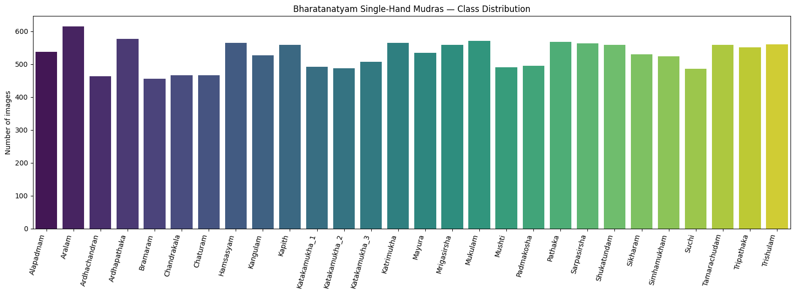
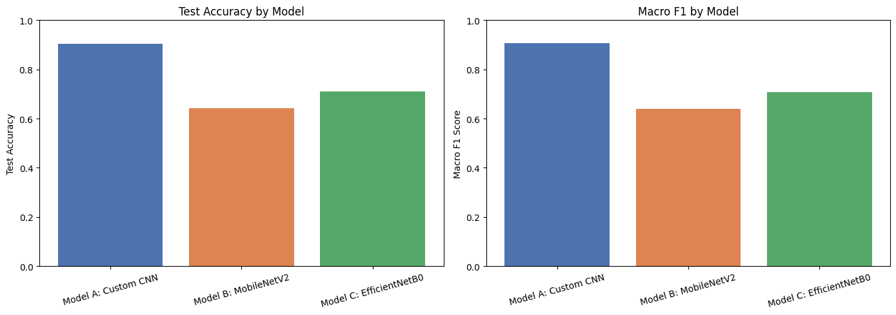
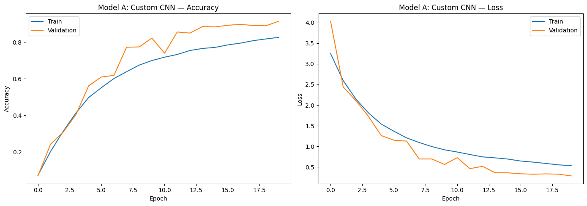
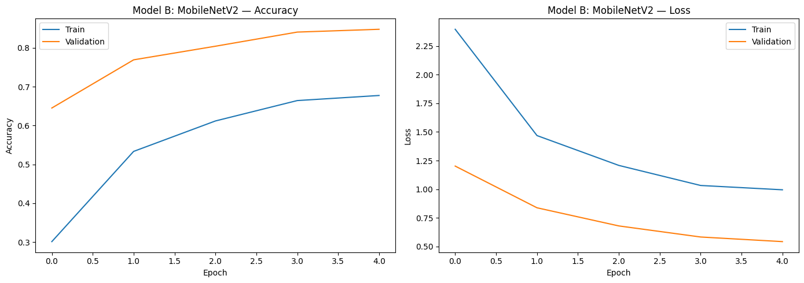
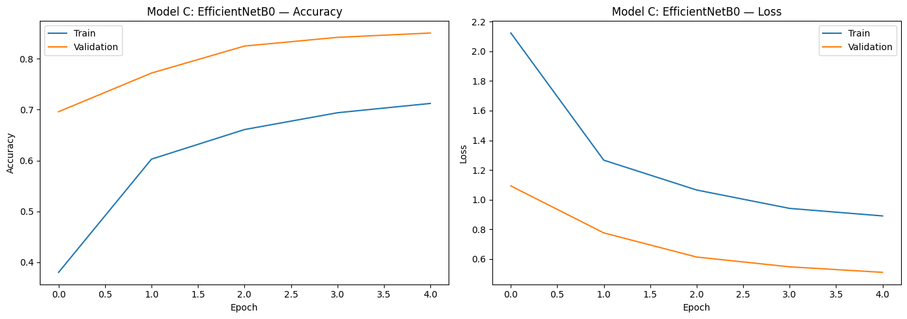
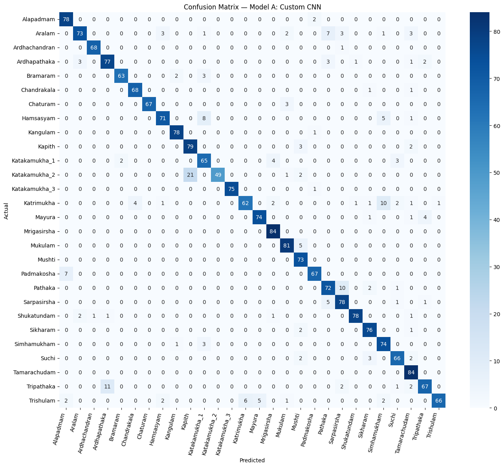
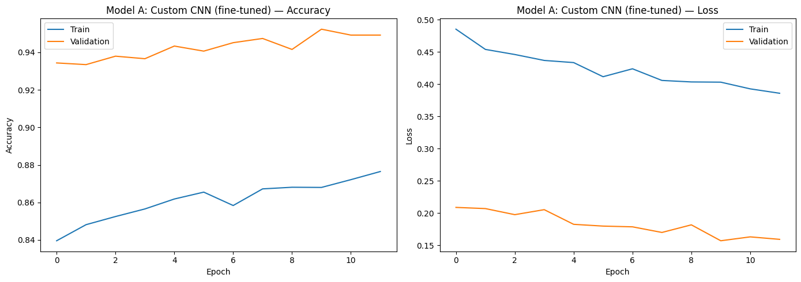

# Bharatanatyam Mudra (Hand Gesture) Recognition

An end-to-end deep learning pipeline to automatically classify single-hand gestures (*mudras*) from Bharatanatyam, a major form of Indian classical dance. This repository explores three distinct Convolutional Neural Network (CNN) strategies—ranging from an optimized scratch architecture to sophisticated transfer learning configurations—identifies the top performer, evaluates it with advanced interpretability metrics (Grad-CAM), and refines it via intentional fine-tuning.

---

## 📌 Project Overview & Pipeline

Bharatanatyam features an intricate vocabulary of hand gestures used for narrative expression. Automating the recognition of these gestures preserves cultural heritage and serves as a bedrock for real-time educational tools.

### Key Features of the Pipeline
1. **Dataset Ingestion:** Seamless streaming and subset parsing of the targeted Hugging Face source dataset.
2. **Preprocessing & Augmentation:** Dynamic runtime augmentation (rotations, zooms, and contrast shifts) to build model resilience against lighting and angle variations.
3. **Multi-Model Benchmark:** Side-by-side training and metric evaluation of:
   * **Model A:** A custom, compact Deep CNN trained from scratch.
   * **Model B:** MobileNetV2 (Pre-trained on ImageNet) acting as a lightweight feature extractor.
   * **Model C:** EfficientNetB0 (Pre-trained on ImageNet) optimized for parameter efficiency.
4. **Performance Deep-Dive:** Exhaustive structural breakdown using micro/macro metrics, raw confusion matrices, and misclassification logging.
5. **Explainable AI (XAI):** Leveraging **Grad-CAM** (Gradient-weighted Class Activation Mapping) to extract and display the exact visual regions influencing predictions.
6. **Post-Evaluation Fine-Tuning:** Dynamic learning-rate scheduling and optimization adjustments on the champion model to achieve production-grade test accuracy.

---

## 📊 Dataset Insights

The pipeline leverages the **Bharatanatyam Mudra Dataset** (released under the MIT License). 

* **Total Full Dataset:** 28,431 images (comprising both single and double-hand patterns).
* **Target Sub-split:** Isolated to `gesture_type == "single_hand"`, yielding **14,827** images across **28 unique classes** (e.g., *Alapadmam*, *Kapith*, *Sikharam*).
* **Dimensionality & Footprint:** Resized to a standardized 128×128×3 spatial resolution, creating a clean NumPy array footprint (~729 MB).

### Class Distribution
The dataset is largely equitable and robust, showing highly consistent instances across all 28 classes, minimizing historical vulnerabilities to minority class under-representation.



---

## 📈 Model Architecture & Benchmarking

### Benchmarking Results
Models were evaluated over an identical, stratified test slice ($15\%$ of total single-hand records):

| Model Metrics | Test Accuracy | Test Loss | Macro $F_1$-Score | Total Params (M) | Training Duration |
| :--- | :---: | :---: | :---: | :---: | :---: |
| **Model A: Custom CNN** | **90.47%** | **0.3044** | **0.9055** | 0.28 M | ~5.7 mins |
| **Model B: MobileNetV2** | 64.09% | 1.1918 | 0.6393 | 2.43 M | ~0.9 mins |
| **Model C: EfficientNetB0**| 71.15% | 1.0677 | 0.7075 | 4.22 M | ~1.6 mins |



> 💡 **Key Takeaway:** Surprisingly, the targeted **Custom CNN (Model A)** substantially outperformed the frozen pre-trained backbones on this specific domain. This indicates that generic ImageNet features do not automatically translate well to highly isolated, stylized hand-pose silhouettes without deeper layer modifications.

---

### Phase 1 Training History

#### Model A: Custom CNN (Winner)


#### Model B: MobileNetV2


#### Model C: EfficientNetB0


---

## 🎯 Deep Dive: The Winning Model (Custom CNN)

Prior to fine-tuning, the initial Custom CNN was subjected to detailed diagnostic review to find systemic points of confusion.

### Initial Confusion Matrix
The macro accuracy landscape shows strong diagonal dominance, though predictable clusters of mild confusion appear between structural shapes like *Katakamukha_1* and *Katakamukha_2*.



---

## 🔧 Fine-Tuning & Final Results

Because the champion model was our from-scratch Custom CNN, "fine-tuning" was adapted to perform extended, high-resolution optimization. We dropped the base learning rate down to `1e-4` to gently massage structural weights without resetting the embedded features.

### Post-Fine-Tuning History
The model shows excellent asymptotic stability without cross-over signs of validation divergence or severe overfitting.



### Performance Comparison

| Development Phase | Test Accuracy | Macro $F_1$-Score |
| :--- | :---: | :---: |
| Before Fine-Tuning | 90.47% | 90.55% |
| **After Fine-Tuning** | **95.55%** | **95.63%** |

The final model weights have been systematically serialized and exported directly to a lightweight distribution package: `bharatanatyam_Custom_CNN_finetuned.keras`.

---

## 🛠️ Step-by-Step Installation & Usage

### 1. Prerequisites & Environment Setup
Clone this repository and verify your execution system is bound to a dedicated GPU compute instance (e.g., an NVIDIA T4 GPU engine):

```bash
git clone [https://github.com/stephinjacob007/Bharatanatyam-Mudra-Classification-CNN.git](https://github.com/stephinjacob007/Bharatanatyam-Mudra-Classification-CNN.git)
cd Bharatanatyam-Mudra-Classification-CNN
pip install -r requirements.txt
